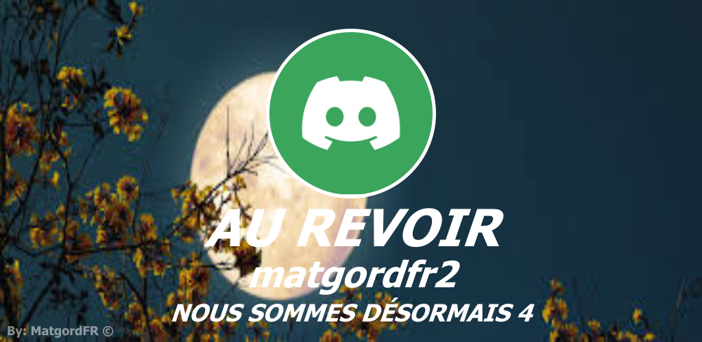

<div align="center">

# 🖼️ welcome-goodbye-cards

**Un bot Discord qui génère des images personnalisées de bienvenue et de départ à chaque arrivée ou sortie de membre.**

[](LICENSE)
[](https://nodejs.org)
[](https://discord.js.org)
[](https://www.npmjs.com/package/canvas)
[](https://github.com/MatgordFR)

</div>

---

## ✨ En deux mots

`welcome-goodbye-cards` génère **une image sur mesure** à chaque événement de membre, avec **canvas** :

- 👋 à l'**arrivée** : une carte de bienvenue (avatar + pseudo + compteur de membres) ;
- 🚪 au **départ** : une carte d'au revoir dans le même style ;
- 🎨 **fonds personnalisables** (tes propres `.png`) ;
- 🛡️ **validation de la config** au lancement (message clair si un salon manque).

Tout est automatique : le membre arrive ou part, la carte tombe dans le bon salon.

## 📑 Sommaire

- [Prérequis](#-prérequis)
- [Installation](#-installation)
- [Configuration](#-configuration)
- [Lancement](#️-lancement)
- [Aperçu](#️-aperçu)
- [Dépannage](#️-dépannage)
- [Structure](#️-structure)
- [Licence](#-licence)

## 🧩 Prérequis

- [Node.js **18+**](https://nodejs.org)
- Un bot créé sur le [Discord Developer Portal](https://discord.com/developers/applications)
- L'intent privilégié **Server Members** activé (*Bot → Privileged Gateway Intents*)

> ⚠️ Sans **Server Members Intent**, le bot ne reçoit pas les arrivées/départs de membres.
> 💡 `canvas` installe des binaires précompilés ; sur certains Linux, des libs système (Cairo/Pango) peuvent être nécessaires.

## 📦 Installation

```bash
git clone https://github.com/MatgordFR/welcome-goodbye-cards.git
cd welcome-goodbye-cards
npm install
cp config.example.json config.json   # puis remplis config.json
```

## 🔧 Configuration

`config.json` (ignoré par git — ton token ne partira jamais sur GitHub) :

| Clé | Description |
|---|---|
| `token` | Token de ton bot Discord |
| `Salon_Bienvenue` | Salon où envoyer la carte de **bienvenue** |
| `Salon_Depart` | Salon où envoyer la carte de **départ** |
| `Salon_Logs_Demarrage` | *(optionnel)* Salon de l'embed de démarrage |
| `color_principal` | *(optionnel)* Couleur de l'embed de démarrage (hex, ex. `#0099ff`) |

> 💡 Au démarrage, le bot **vérifie ta config** : s'il manque `token`, `Salon_Bienvenue` ou `Salon_Depart`, il te le dit clairement et s'arrête.

Place tes fonds dans `image/` (**1024 × 500 px**) : `Bienvenue.png` et `Depart.png`. L'avatar est dessiné dans le cercle en haut, le pseudo et le compteur en dessous.

## ▶️ Lancement

```bash
npm start
```

Le bot se connecte, poste son embed de démarrage, puis écoute arrivées et départs.

## 🖼️ Aperçu

| Bienvenue | Départ |
|---|---|
|  |  |

## 🛠️ Dépannage

| Symptôme | Piste |
|---|---|
| `[CONFIG] config.json invalide…` | Une clé manque/est vide dans `config.json` (le message dit laquelle) |
| Pas de carte de bienvenue/départ | `Salon_Bienvenue` / `Salon_Depart` sont les **bons IDs** ? Le bot voit le salon ? |
| Aucun événement membre | **Server Members Intent** activé dans le Developer Portal ? |
| `Unsupported image type` | Souci de chargement de l'avatar (réseau) — réessaie |
| `Cannot find module` | Relance `npm install` |

## 🗂️ Structure

```
welcome-goodbye-cards/
├─ index.js               # point d'entrée + validation de la config
├─ config.example.json    # gabarit à copier vers config.json
├─ package.json
├─ LICENSE
├─ events/
│  ├─ ready.js            # embed de démarrage + statut rotatif
│  ├─ guildMemberAdd.js   # carte de bienvenue
│  └─ guildMemberRemove.js# carte de départ
├─ utils/
│  └─ canvas.js           # génération des cartes (partagé)
├─ image/                 # fonds (Bienvenue.png / Depart.png)
└─ preview/               # aperçus (README)
```

## 📄 Licence

ISC — © 2026 MatgordFR. Voir [LICENSE](LICENSE).

<div align="center">
<sub>Fait avec ❤️ par <a href="https://github.com/MatgordFR">MatgordFR</a> · <a href="https://x.com/matgordfr">@matgordfr</a></sub>
</div>
